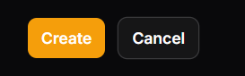
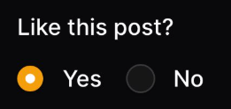

# Form

[Back](./..)

- [Remove CreateAnother Button](#remove-createanother-button-️)
- [Inline Label Position](#inline-label-position-️)
- [Reactive Method](#reactive-method-%EF%B8%8F)

## Remove CreateAnother Button ([⬆️](#form))



```php
class ManageCustomers extends ManageRecords
{
    protected static string $resource = CustomerResource::class;

    protected function getHeaderActions(): array
    {
        return [
            Actions\CreateAction::make()
                ->createAnother(false),
        ];
    }
}
```

Or

You can use another way for **create page**

```php
protected static bool $canCreateAnother = false;
```

## Inline Label Position ([⬆️](#form))



```php
use Filament\Forms\Components\Radio;

Radio::make('feedback')
    ->label('Like this post?')
    ->options([
        '1' => 'Yes',
        '0' => 'No',
    ])
    ->inline()
    ->inlineLabel(false),
```

## Reactive Method ([⬆️](#form))

```php
use Filament\Forms;

Forms\Components\Select::make('user_type')
    ->label('User Type')
    ->options([
        'student' => 'Student',
        'teacher' => 'Teacher',
    ])
    ->reactive(),

Forms\Components\TextInput::make('student_id')
    ->label('Student ID')
    ->hidden(fn ($get) => $get('user_type') !== 'student'),

```

- এখানে **user_type** এর ভিতরে **reactive** মেথড ব্যবহার করার কারণে যখনই **user_type** পরিবর্তন হবে তখন সে অনুযায়ী **student_id** রেস্পন্স করবে। 
- বিশেষ করে ->hidden(), ->visible(), ->disable(), ->required() এ condition ব্যবহার করলে reactive প্রয়োজন।

Thank you for staying with me.  
Please follow and subscribe to my YouTube channel: [YouTube Channel Link](https://www.youtube.com/@MirzaMdGolamNabi)
