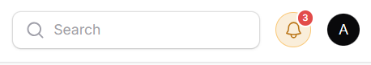

# UI Design

[Back](./..)

- [Notification Bell Icon](#notification-bell-icon-️)

## Notification Bell Icon ([⬆️](#ui-design))

The Notification Bell Icon will be displayed next to the user menu.



To create this icon, you need to build a custom Livewire component. Run the following command:

```sh
php artisan make:livewire NotificationBell
```

This command will generate two files:
- /app/Livewire/NotificationBell.php
- /resources/views/livewire/notification-bell.blade.php

Now, add the following code to the **notification-bell.blade.php** file:

```html
<div>
    <button
        style="position:relative; display:inline-flex; align-items:center; justify-content:center; width:35px; height:35px; border-radius:50%; background:#FAEEDA; border:0.5px solid #FAC775; cursor:pointer;"
    >
        <x-filament::icon
            icon="heroicon-o-bell"
            style="width:20px; height:20px; color:#BA7517;"
        />

        {{-- Unread Badge --}}
        <span style="position:absolute; top:-4px; right:-4px; width:18px; height:18px; background:#E24B4A; border-radius:50%; display:flex; align-items:center; justify-content:center; font-size:9px; font-weight:500; color:#fff; border:2px solid white;">
            3
        </span>
    </button>
</div>
```

Next, go to your Panel Provider and use the **renderHook()** method to include the component:

```php
use Filament\Panel;
use Filament\View\PanelsRenderHook;
use Illuminate\Support\Facades\Blade;

public function panel(Panel $panel): Panel
{
    return $panel
        // ...
        ->renderHook(
            PanelsRenderHook::USER_MENU_BEFORE,
            fn (): string => Blade::render('@livewire(\'notification-bell\')'),
        );
}
```

Now, the Notification Bell Icon will appear next to the user menu successfully.

Thank you for staying with me.  
Please follow and subscribe to my YouTube channel: [YouTube Channel Link](https://www.youtube.com/@MirzaMdGolamNabi)