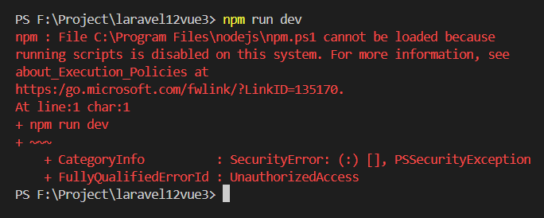

# Issue or Bug Fix

[Back](./..)

- [npm run dev problem](#npm-run-dev-problem-️)

## npm run dev problem ([⬆️](#issue-or-bug-fix))

If you face a problem as like as image after running **npm run dev**, then follow the step:<br>


Open your terminal and run this command:

```sh
Set-ExecutionPolicy Unrestricted -Scope CurrentUser
```

Then run **npm** command:

```sh
npm run dev
```

✅ Your problem has been solved.😎

#### Extra Command

If you go back the previous mode, then run this command:

```sh
Set-ExecutionPolicy restricted -Scope CurrentUser
```

If you want to know the **Execution Policy** mode, then run this command:

```sh
Get-ExecutionPolicy -Scope CurrentUser
```

Thank you for staying with me.  
Please follow and subscribe to my YouTube channel: [YouTube Channel Link](https://www.youtube.com/@MirzaMdGolamNabi)
