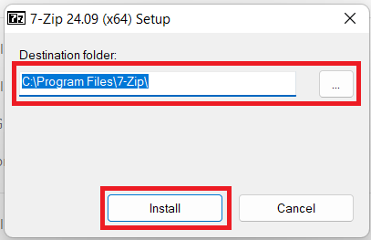
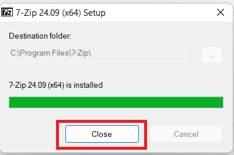

# 7 Zip

[Back](./..)

- [7 Zip Installation Process](#7-zip-installation-process-%EF%B8%8F)

## 7 Zip Installation Process ([⬆️](#7-zip))
### 1. Follow the installation rules step-by-step
a. Open the 7 Zip Software. Select the destination folder and click the install button 

b. After finishing the installation then click the "Close" button 

Thank you for staying with me.  
Please follow and subscribe to my YouTube channel: [YouTube Channel Link](https://www.youtube.com/@MirzaMdGolamNabi)

