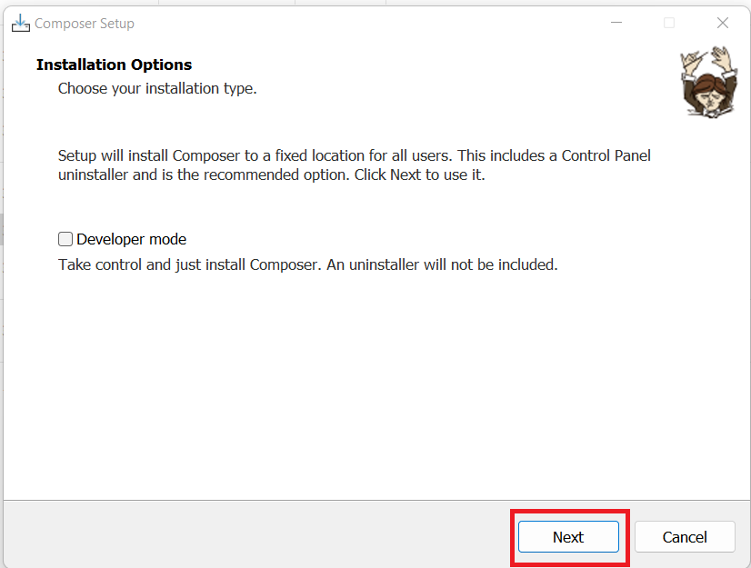
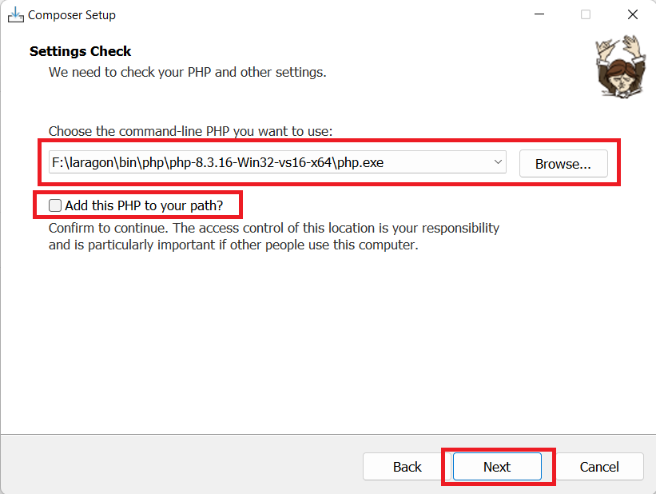

# Composer

[Back](./..)

- [Composer Installation Process](#composer-installation-process-%EF%B8%8F)

## Composer Installation Process ([⬆️](#composer))
### 1. Download Composer software from the link

```sh
https://getcomposer.org/download
```

[Download Link](https://getcomposer.org/download)

### 2. Follow the Composer software installation rules step-by-step
a. Open the Composer Software and click "Install for all users(recommended)" button<br>


b. Then click the "Next" button<br>


c. Select the PHP path and click the next<br>


d. Then click "Next"<br>


e. Then click "Install"<br>


f. Then click "Next"<br>


g. Then click the "Finish" button<br>


h. Open the terminal, type "composer", and press the Enter button. If you see the Composer version, it means your Composer setup was successful.<br>


Thank you for staying with me.  
Please follow and subscribe to my YouTube channel: [YouTube Channel Link](https://www.youtube.com/@MirzaMdGolamNabi)

