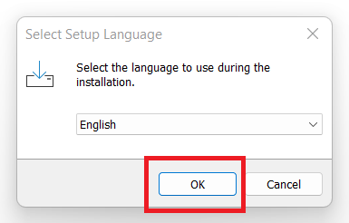
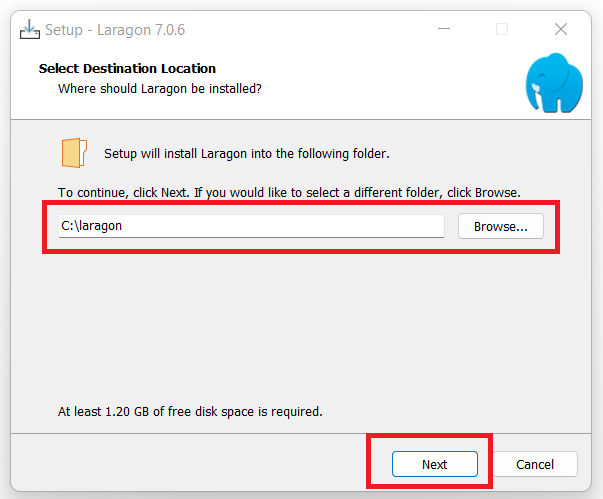
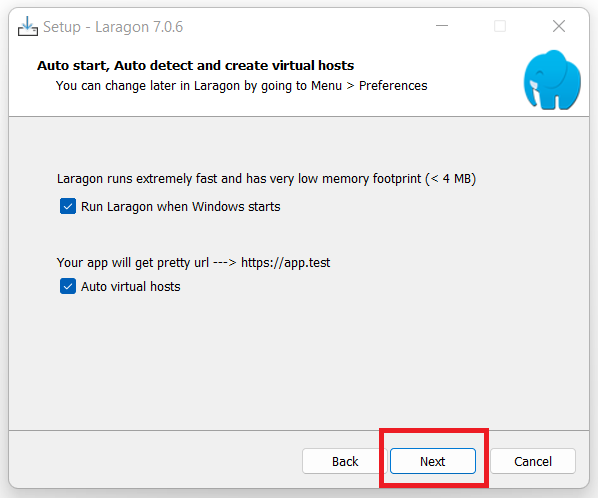
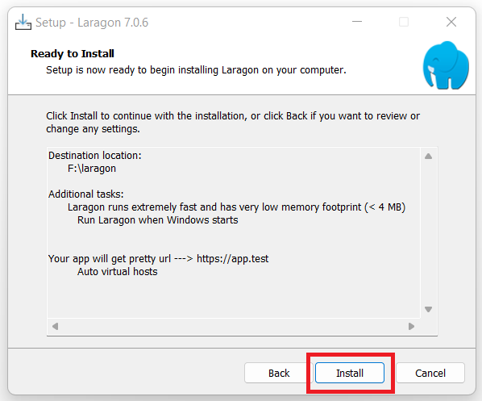
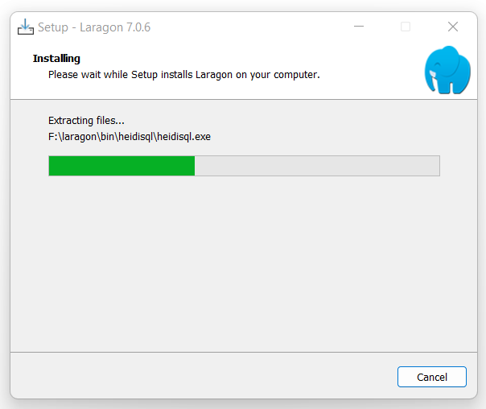
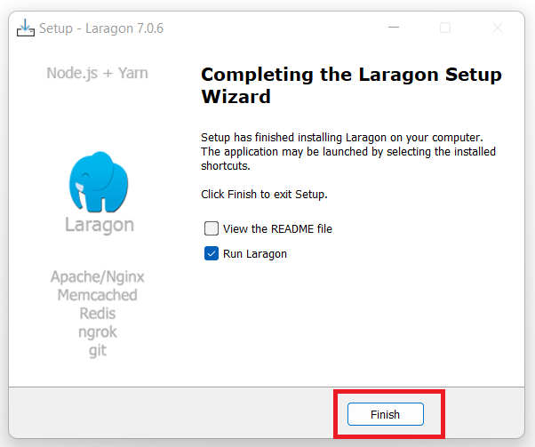
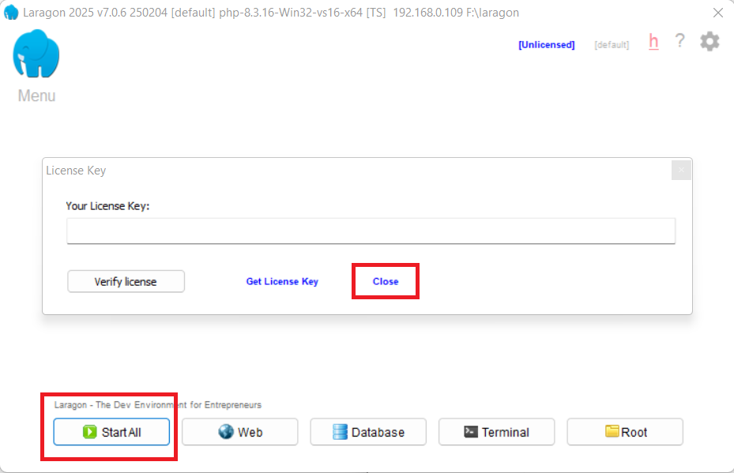
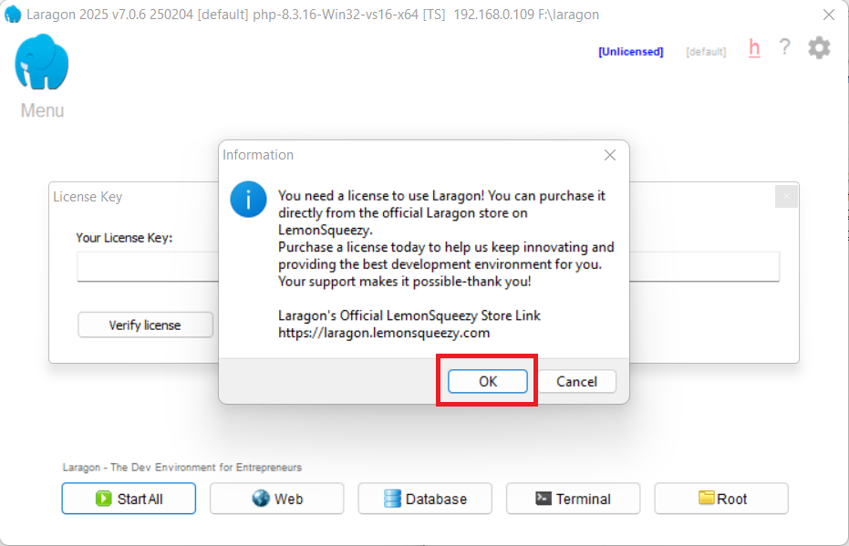
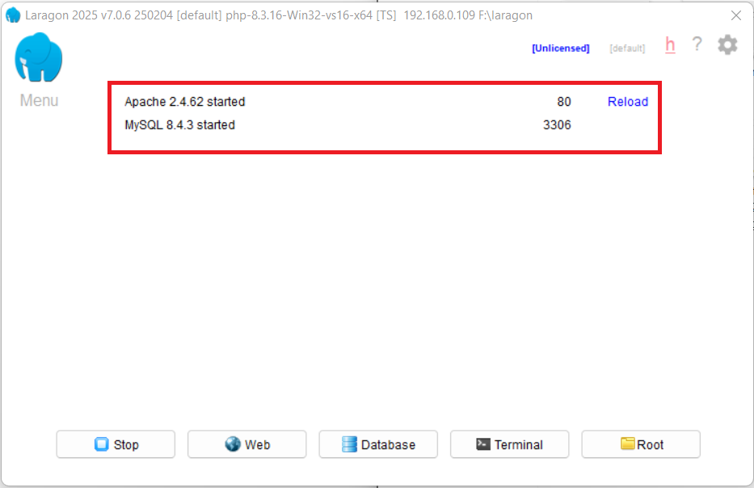

# Laragon

[Back](./..)

- [Laragon Installation Process](#laragon-installation-process)

## Laragon Installation Process ([⬆️](#laragon))
### 1. Download Laragon software from the link

```sh
https://laragon.org/download
```

[Download Link](https://laragon.org/download)

### 2. Follow the Laragon software installation rules step-by-step
a. Open the Laragon Software and click "Ok" button


b. Select the destination location and click the next


c. Then click "Next"


d. Then click "Install"


e. Wait few seconds for installing


f. Then click "Finish"


g. Then you see this interface. Click the "close" button and the click the "Start All" button


h. Then click the "Ok" button


i. Finally you see the your server is ready.


Thank you for staying with me.  
Please follow and subscribe to my YouTube channel: [YouTube Channel Link](https://www.youtube.com/@MirzaMdGolamNabi)

