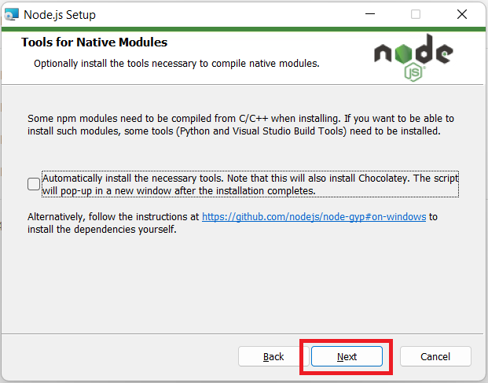

# Node JS

[Back](./..)

- [Node JS Installation Process](#node-js-installation-process-%EF%B8%8F)

## Node JS Installation Process ([⬆️](#node-js))
### 1. Download Node JS software from the link

```sh
https://nodejs.org/en/download
```

[Download Link](https://nodejs.org/en/download)


### 2. Follow the installation rules step-by-step
a. Open the node js Software and click the "Next" button<br>


b. Then accept the agreement terms and click the "Next" button<br>


c. Select the destination folder and click the "Next" button<br>


d. Again click the "Next" button<br>


e. Again click the "Next" button<br>


f. Now click the "Install" button<br>


g. Wait few minutes for installing Node js<br>


h. Then click "Finish" button<br>


i. After completing the software installation, open the command prompt and check whether Node.js is installed successfully. Run the following two commands in your terminal:

```sh
node --version
npm --version
```
**N.B: If you see the version number, it means Node.js has been installed successfully.**<br>


Thank you for staying with me.  
Please follow and subscribe to my YouTube channel: [YouTube Channel Link](https://www.youtube.com/@MirzaMdGolamNabi)

