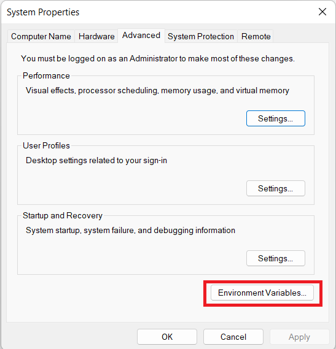

# PHP

[Back](./..)

- [PHP Installation Process](#php-installation-process-️)
- [Set the PHP Path in Windows](#set-the-php-path-path-in-windows-️)
- [Set PHP version in Laragon](#set-php-version-in-laragon-️)

## PHP Installation Process ([⬆️](#php))

### 1. Follow the installation rules step-by-step

a. Open the Laragon Software<br>


b. Click the "Menu" button and Goto **Tools > Quick Add > php** <br>
Choose your desire version.<br>


**If you don't see your desire version, then click this [Link](#set-php-version-in-laragon-️)**

c. Wait few minutes for downloading **PHP**<br>


d. Then select your **PHP** version from **PHP > Version > your_desire_version**<br>


e. If you want to change the folder name from long to short, then go to **dir:** option as like as image.<br>


f. Now go back one step to get your desire location as like as image.<br>


g. After change the folder name, then you can see this as like as image.<br>


h. Now you need to set the **Environment** path. So press the windows button and write **environment**. Then choose the **Edit the system environment variables**<br>


i. Then select the **Environment Variables**<br>


j. Select **Path** from system variables, and click **Edit** button.<br>


k. Click **New** button, and set your **PHP** path.<br>


l. Then press all the **OK** button. Now check your **PHP** installed successfully or not.<br>
Open Command Prompt (cmd), then run:
```sh
php --version
```


**If you get PHP version number, then everything is OK**

## Set the PHP Path (PATH) in Windows ([⬆️](#php))

- Open Start Menu and search for "**Environment Variables**".
- Click "**Edit the system environment variables**".
- In the System Properties window, go to the **Advanced** tab and click "**Environment Variables**".
- Under System variables, find "**Path**", select it, and click "**Edit**".
- Click "**New**" and add the **PHP** bin folder path (e.g., F:\laragon\bin\php\php-8.3).
- Click OK > OK > Apply to save the changes.
- Open Command Prompt (cmd), then run:

```sh
php --version
```

**N.B.** If you get php version number, the PATH is set correctly!

**Example:**<br>
My PHP bin folder path is **F:\laragon\bin\php\php-8.3**

## Set PHP version in Laragon ([⬆️](#php))

If you want to set **PHP** version in Laragon, then follow these steps:

1. Open the Laragon Software<br>


2. Click the "Menu" button and Goto **Tools > Quick Add > Configuration** <br>


3. Open a file in a editor. Now add the **PHP** version link what you want.<br>


**For PHP 8.4**
```sh
https://windows.php.net/downloads/releases/archives/php-8.4.2-nts-Win32-vs17-x64.zip
```

**For PHP 8.3**
```sh
https://windows.php.net/downloads/releases/archives/php-8.3.15-nts-Win32-vs16-x64.zip
```

**For PHP 8.2**
```sh
https://windows.php.net/downloads/releases/archives/php-8.2.27-nts-Win32-vs16-x64.zip
```

**For PHP 8.1**
```sh
https://windows.php.net/downloads/releases/archives/php-8.1.31-nts-Win32-vs16-x64.zip
```

**For PHP 7.4**
```sh
https://windows.php.net/downloads/releases/archives/php-7.4.33-Win32-vc15-x64.zip
```

**For PHP 7.3**
```sh
https://windows.php.net/downloads/releases/archives/php-7.3.33-nts-Win32-vc15-x64.zip
```

**For PHP 7.2**
```sh
https://windows.php.net/downloads/releases/archives/php-7.2.34-nts-Win32-VC15-x64.zip
```

**For PHP 7.1**
```sh
https://windows.php.net/downloads/releases/archives/php-7.1.33-nts-Win32-VC14-x64.zip
```

**N.B.** All the PHP version works only on 64-bit operating systems.

Thank you for staying with me.  
Please follow and subscribe to my YouTube channel: [YouTube Channel Link](https://www.youtube.com/@MirzaMdGolamNabi)
