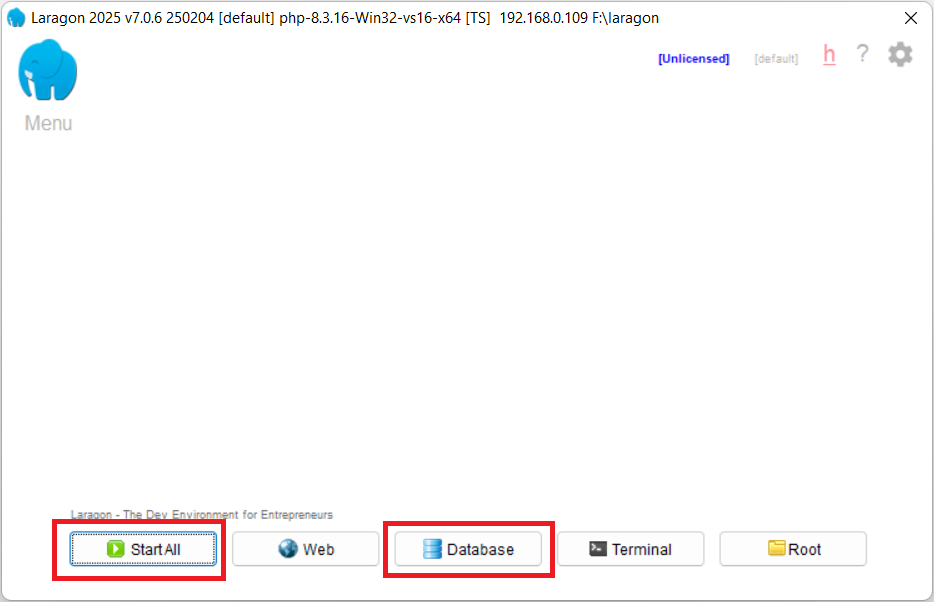

# phpMyAdmin

[Back](./..)

- [phpMyAdmin Installation Process](#phpmyadmin-installation-process)

## phpMyAdmin Installation Process ([⬆️](#phpmyadmin))
### 1. Follow the installation rules step-by-step
a. Open the Laragon Software 

b. Click the "Menu" button and Goto **Tools > Quick Add > phpmyadmin** 

c. First start your server, click "Start All". Then click the "Database" 

d. Type "root" as the username and leave the password field empty. Then click the "Log in" button 

e. After login, you can see this dashboard 

Thank you for staying with me.  
Please follow and subscribe to my YouTube channel: [YouTube Channel Link](https://www.youtube.com/@MirzaMdGolamNabi)

