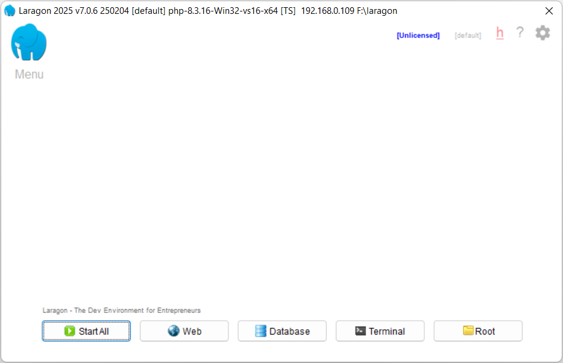
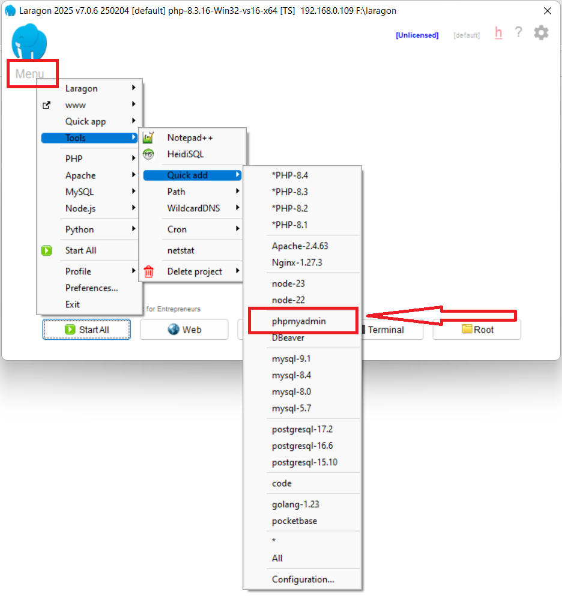
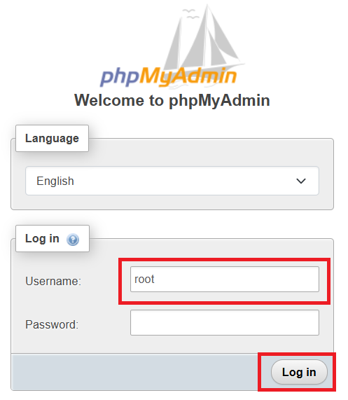
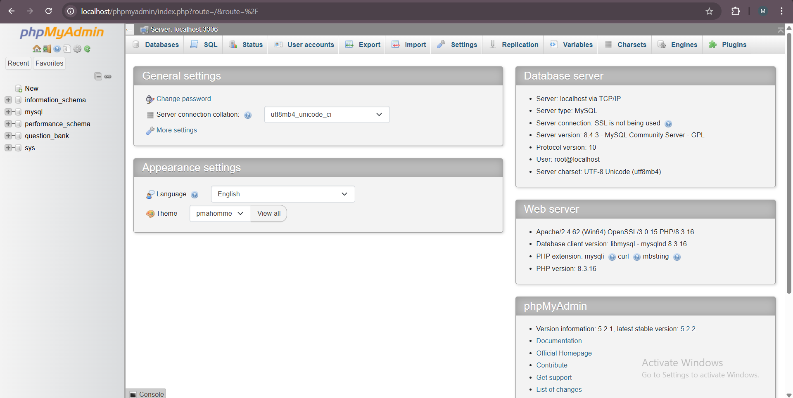

# phpMyAdmin

[Back](./..)

- [phpMyAdmin Installation Process](#phpmyadmin-installation-process-%EF%B8%8F)
- [Set the MySQL Path in Windows](#set-the-mysql-path-path-in-windows-️)

## phpMyAdmin Installation Process ([⬆️](#phpmyadmin))
### 1. Follow the installation rules step-by-step
a. Open the Laragon Software<br>


b. Click the "Menu" button and Goto **Tools > Quick Add > phpmyadmin**<br>


c. First start your server, click "Start All". Then click the "Database"<br>


d. Type "root" as the username and leave the password field empty. Then click the "Log in" button<br>


e. After login, you can see this dashboard<br>



## Set the MySQL Path (PATH) in Windows ([⬆️](#phpmyadmin))
* Open Start Menu and search for "Environment Variables".
* Click "Edit the system environment variables".
* In the System Properties window, go to the Advanced tab and click "Environment Variables".
* Under System variables, find "Path", select it, and click "Edit".
* Click "New" and add the MySQL bin folder path (e.g., C:\xampp\mysql\bin).
* Click OK > OK > Apply to save the changes.
* Open Command Prompt (cmd), then run:
```sh
mysql -u root -p
```

**N.B.** If MySQL starts successfully, the PATH is set correctly!

**Example:**<br>
My mySQL bin folder path is ***F:\laragon\bin\mysql\mysql-8.4.3-winx64\bin***


Thank you for staying with me.  
Please follow and subscribe to my YouTube channel: [YouTube Channel Link](https://www.youtube.com/@MirzaMdGolamNabi)

