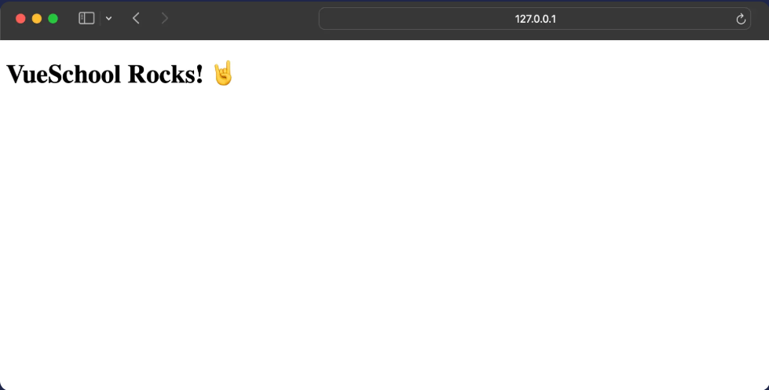

# Vue

[Back](./..)

- [Vue Installation Process in Laravel]()

## Vue Installation Process in Laravel ([⬆️](#vue))

In **Laravel 12** version, I will show you how to install **Vue** in your Laravel project.

1. First, installed a fresh Laravel project.

```sh
laravel new project-name
```

**If you can't do that, follow this [Link](./../README.md#laravel-install-️)**

2. After installed a fresh Laravel project, then we install Laravel related npm dependencies.

```sh
npm install
```

3. Now, we’re ready to invite Vue to the party. Run this command:

```sh
npm install vue vue-router @vitejs/plugin-vue
```

After run that command, we have seen that dependencies in the **package.json** file.

```sh
"dependencies": {
    "@vitejs/plugin-vue": "^5.2.3",
    "vue": "^3.5.13",
    "vue-router": "^4.5.0"
}
```

4. Config your **_vite.config.js_** file

```sh
import { defineConfig } from 'vite';
import laravel from 'laravel-vite-plugin';
import tailwindcss from '@tailwindcss/vite';
import vue from "@vitejs/plugin-vue";

export default defineConfig({
    plugins: [
        vue(),
        laravel({
            input: [
                'resources/css/app.css',
                'resources/js/app.js'
            ],
            refresh: true,
        }),
        tailwindcss(),
    ],
    resolve: {
        alias: {
            "@": "/resources/js",
            vue: "vue/dist/vue.esm-bundler.js",
        },
    },
});
```

**Added vue() and resolve**

The resolve.alias section defines shortcuts:

- **@** maps to /resources/js for cleaner imports
- **vue** points to vue.esm-bundler.js for proper Vue bundling

5. Head to **./resources/js** and create a new file **App.vue**. This file will serve as an entry point for our Vue.js application.

```html
<template>
  <h2>VueSchool Rocks! 🤘</h2>
</template>
```

6. Time to create a new Vue app instance in our Laravel project. To do so, we’ll need to modify **./resources/js/app.js** file and add the following:

```sh
import "./bootstrap";
import { createApp } from "vue";

import App from "./App.vue";

createApp(App).mount("#app");
```

7. This will mount our Vue app inside an element with the id of “app”. Let’s create that **<div>** within the **<body>** of **./resources/views/welcome.blade.php** file. This Blade file containing our **Vue** app, is the only Laravel file that will be exposed to the browser.

```html
<body>
  <div id="app"></div>
</body>
```

8. We also have to import our **./resources/js/app.js** file using the **@vite()** Blade directive.

```html
<head>
  @vite(['resources/js/app.js'])
</head>

<body>
  <div id="app"></div>
</body>
```

Now, With just that, we got Vue working with Laravel 🥳 We can test it by running **npm run dev** and **php artisan serve**
<br>


Thank you for staying with me.  
Please follow and subscribe to my YouTube channel: [YouTube Channel Link](https://www.youtube.com/@MirzaMdGolamNabi)
