# Tips & Tricks

[Back](./..)

- [whereKey](#wherekey-️)
- [whereIn](#wherein-️)
- [whereIn with Params](#wherein-with-param-️)

## whereKey ([⬆️](#tips--tricks))

Use **whereKey** instead of **whereIn** for cleaner and more readable queries, as it automatically uses the model's primary key. Similarly, **whereKeyNot** works like **whereNotIn**

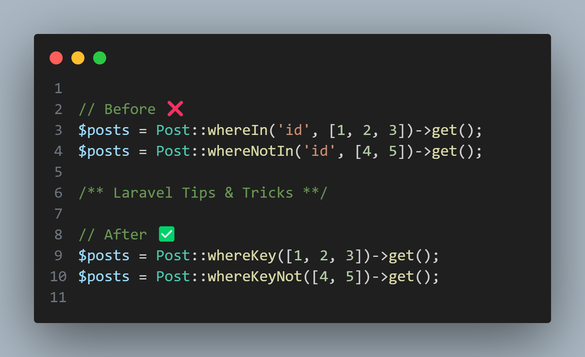

## whereIn ([⬆️](#tips--tricks))

Using **find()** with multiple IDs returns a collection, making it easier to work with multiple records at once. If any ID doesn't exist, it simply won't appear in the result instead of causing an error. Unlike **firstOrFail()**, **find()** won't throw an exception if a record isn't found.

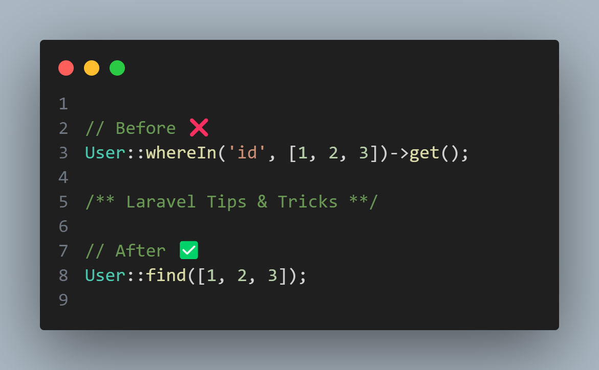

## whereIn with Param ([⬆️](#tips--tricks))

Using **find()** with multiple IDs returns a collection, making it easier to work with multiple records at once. If any ID doesn't exist, it simply won't appear in the result instead of causing an error. Unlike **firstOrFail()**, **find()** won't throw an exception if a record isn't found.

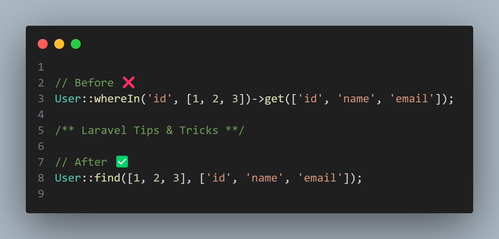

## pipe method ([⬆️](#tips--tricks))

The latest Laravel update introduces a new **pipe()** method to query builders, enabling the application of transformations that can return custom results. This enhances query flexibility and customization.

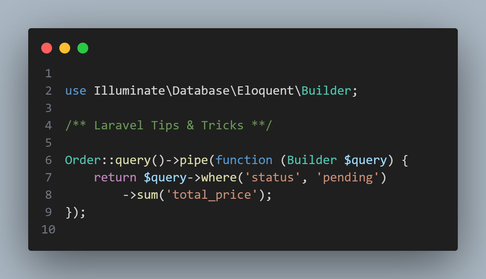

## only and except method ([⬆️](#tips--tricks))

The **except()** method is perfect for hiding sensitive or unnecessary model attributes when returning data, especially in APIs. It's the clean inverse of **only()**, helping keep your payloads minimal and secure.

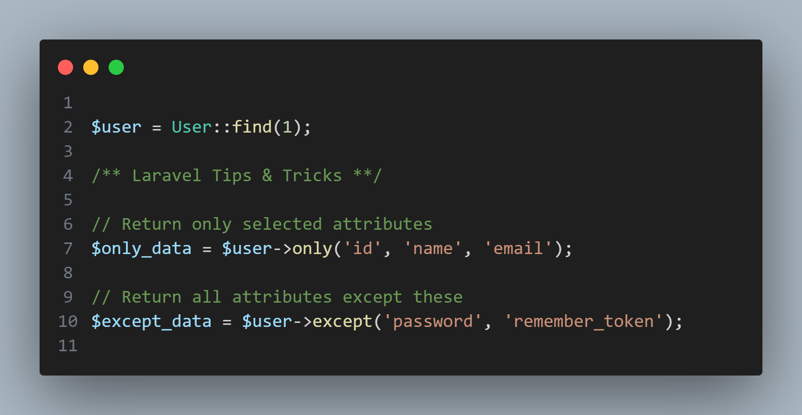

## whereAttachedTo method ([⬆️](#tips--tricks))

The new **whereAttachedTo()** method in Laravel is a cleaner and more expressive way to filter models by their relationships. It eliminates the need for verbose subqueries like **whereHas()**

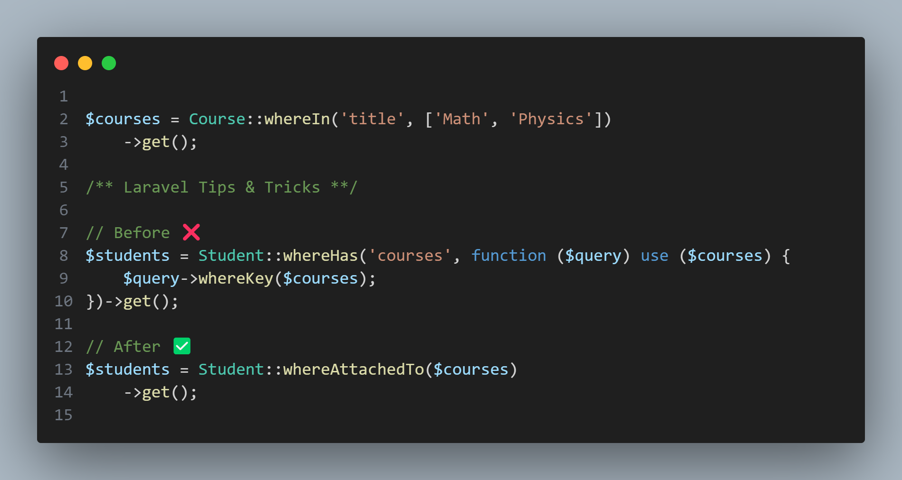

## findMany method ([⬆️](#tips--tricks))

You can retrieve multiple records by passing an array of IDs directly to **Model::find()** or **Model::findMany()**. Both work the same, but **findMany()** makes your intent clearer and your code more expressive.

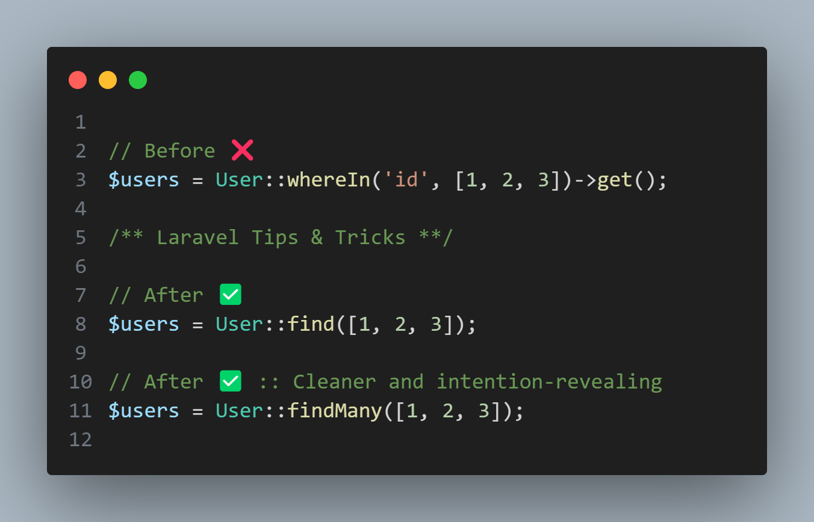

## makeHidden and makeVisible method ([⬆️](#tips--tricks))

Use Laravel's **makeHidden()** and **makeVisible()** methods to effortlessly manage attribute visibility without permanently altering your model's settings. perfect for securely controlling API responses or debugging sensitive data on-the-fly!

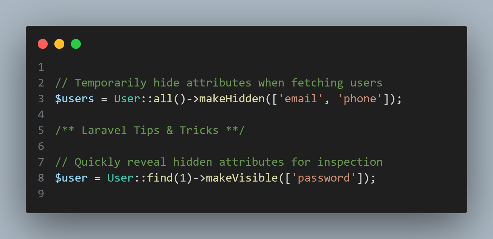

## join and implode method ([⬆️](#tips--tricks))

Use **join()** instead of **implode()** for human-friendly strings! It handles the final separator intelligently, great for readable lists.

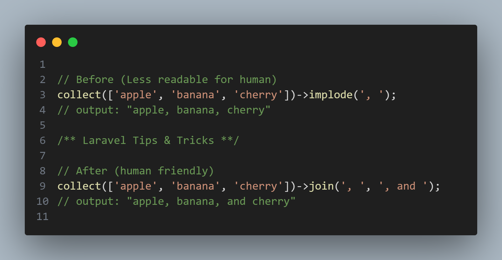

## firstWhere method ([⬆️](#tips--tricks))

You can simplify your Eloquent queries in Laravel by using **firstWhere()** instead of chaining **where()->first()**. It makes your code cleaner and more readable.

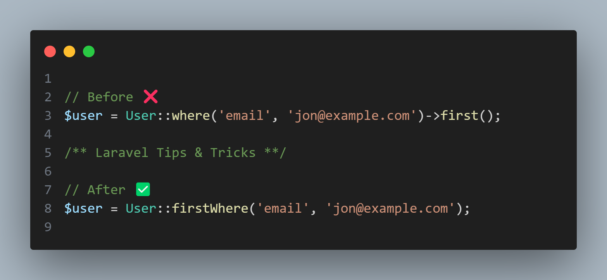

## isDirty, isClean and wasChanged method ([⬆️](#tips--tricks))

Use **isDirty()** before saving to prevent unnecessary database writes. Combine **getOriginal()** with **wasChanged()** for precise audit logging. **getChanges()** is handy for debugging or event-driven change tracking.

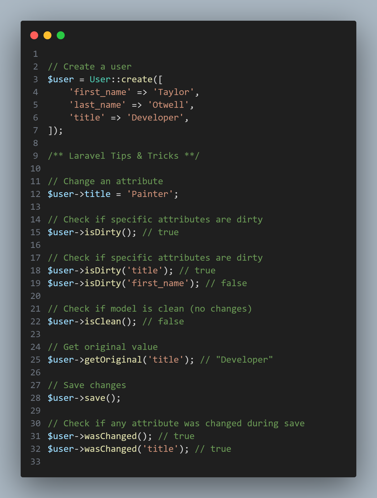

## heading method ([⬆️](#tips--tricks))

Did you know, **Str::headline()** turns **snake_case** or **kebab-case** into title case instantly.

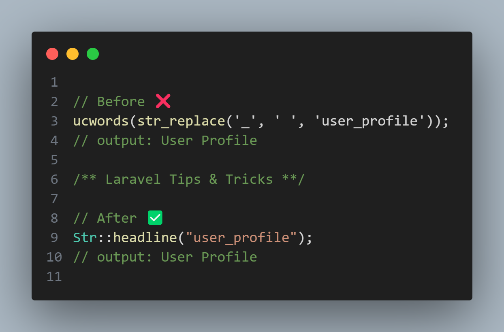

Thank you for staying with me.  
Please follow and subscribe to my YouTube channel: [YouTube Channel Link](https://www.youtube.com/@MirzaMdGolamNabi)